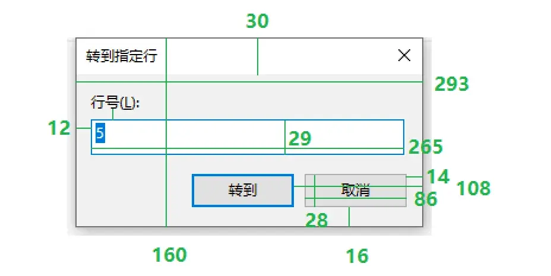
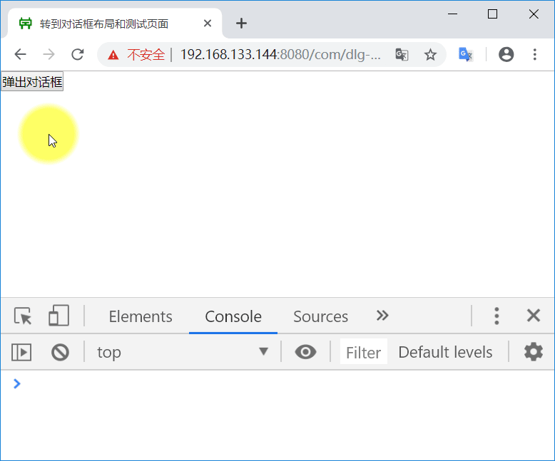
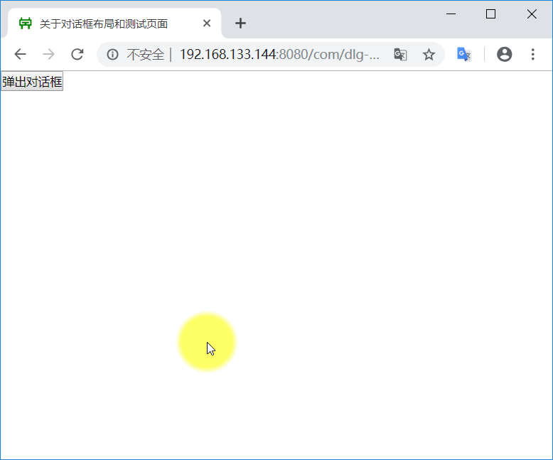
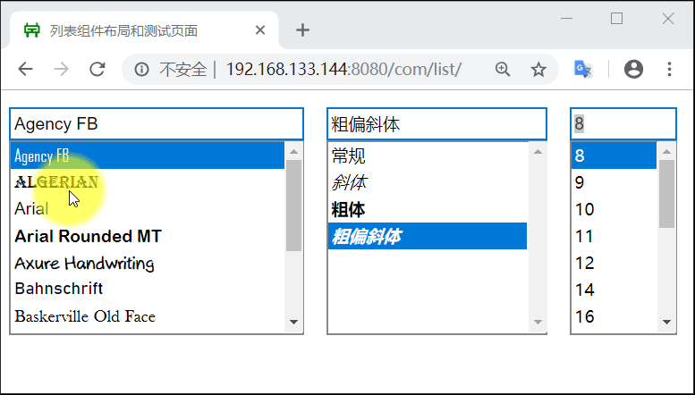

# 第 7 章：自定义 UI 组件

## 阅读参考资料

- [前端工程：基础篇](https://github.com/fouber/blog/issues/10)
- [构建表单小工具](https://developer.mozilla.org/zh-CN/docs/Learn/HTML/Forms/How_to_build_custom_form_widgets)
- [jspaint web app 仓库](https://github.com/1j01/jspaint)
- [BEM 入门](https://segmentfault.com/a/1190000009953887)
- [RequireJS 官网](https://requirejs.org/)
- [RequireJS 的用法](http://www.ruanyifeng.com/blog/2012/11/require_js.html)
- [前端模块管理器简介](http://www.ruanyifeng.com/blog/2014/09/package-management.html)
- [JavaScript 文件加载](http://www.ruanyifeng.com/blog/2011/10/javascript_loading.html)
- [阿当大话西游之 WEB 组件](https://www.imooc.com/learn/99)
- [require.js 开发宝典](https://www.bilibili.com/video/av40283921)

## 矩形计算器 v1.2

基本要求：
- 进一步完善 rectangle 仓库代码
- 在界面的右上角增加 fork-me-on-github UI 组件
- 在界面的右下角增加网站计数器 UI 组件
- 两个组件的网址如下：
```
https://i.wangding.co/js/fork-me-github.js
https://i.wangding.co/js/bsz-page-footer.js
```

示例参考：
- [矩形计算器 v1.2](https://wangding.github.io/rectangle/)

## 定时器按钮组件

基本要求：
- 在 spa 仓库创建 41-timer-button 目录
- 封装定时器按钮组件
- 封装后的代码文件包括：一个 js 文件和一个 css 文件
- 定时器按钮支持两种应用场景
- 场景一：初始状态禁用，倒计时后，按钮启用，启用后按钮可以点击，点击后按钮一直处于启用状态
- 场景二：初始状态启用，点击按钮后，按钮禁用，倒计时，倒计时结束后，按钮启用，循环往复
- 创建定时器按钮时，可以通过参数初始化：
  - container：创建定时器按钮的容器
  - tLength：定时器时长
  - enable：定时器按钮的初始状态
  - title：定时器按钮的文字
- 定时器按钮启用状态，被点击时，执行个性化的事件处理，而不是写死在组件中的事件处理
- 编写定时器按钮的测试页面

示例参考：
- [定时器按钮](https://fe.wangding.co/04-ui-component/01-button/09-index.html)

## 密码可见组件

基本要求：
- 在 spa 仓库创建 42-password-visual 目录
- 封装密码可见组件
- 封装后的代码文件包括：一个 js 文件和一个 css 文件
- 创建密码可见组件时，可以通过参数初始化：
  - container: 创建密码可见组件的容器
- 密码可见组件暴露一个 getPwd 方法，返回密码明文
- 编写密码可见组件的测试页面

示例参考：
- [密码可见](https://fe.wangding.co/04-ui-component/02-password/01-index.html)

## jsnotepad 转到对话框

基本要求：

- 在 GitHub 上创建 jsnotepad 项目仓库
- 实现 grunt 自动化构建，包括：静态代码检查、单元测试和性能优化构建任务
- 打开 win10 notepad 程序，调出转到对话框
- 把转到对话框屏幕截图，测量对话框中各个控件的位置和尺寸数据，参考下图：



- 根据上面测量的数据，编写转到对话框组件的 CSS 样式表
- 后续作业任务中的 jsnotepad 界面组件的样式表文件的编写，于此类似
- 实现转到对话框
- 转到对话框的样式以及功能参考 win10 的记事本程序
- 转到对话框要实现字符级和集中数据合法性校验
- 错误信息气泡提示框的实现，请参考：[制作 CSS 气泡框](http://www.ruanyifeng.com/blog/2010/04/css_speech_bubbles.html)
- 转到对话框要实现参数初始化
- 编写测试页面，测试转到对话框，如下图所示：



示例参考：
- [转到对话框](https://github.com/wangding/jsnotepad/tree/feat-d-goto/com/dlg-goto)


## jsnotepad 关于对话框

基本要求：

- 实现关于对话框
- 关于对话框的样式、内容以及功能参考 win10 的记事本程序
- 编写测试页面，测试关于对话框，如下图所示：




示例参考：
- [关于对话框](https://github.com/wangding/jsnotepad/tree/feat-d-about/com/dlg-about)

## jsnotepad 查找对话框

基本要求：

- 实现查找对话框
- 查找对话框的样式以及功能参考 win10 的记事本程序
- 编写测试页面，测试查找对话框

示例参考：
- [查找对话框](https://github.com/wangding/jsnotepad/tree/feat-d-search/com/dlg-search)

## jsnotepad 查找替换对话框

基本要求：

- 实现查找替换对话框
- 查找替换对话框的样式以及功能参考 win10 的记事本程序
- 编写测试页面，测试查找替换对话框

示例参考：
- [查找替换对话框](https://github.com/wangding/jsnotepad/tree/feat-d-replace/com/dlg-replace)

## jsnotepad 列表框组件

基本要求：

- 实现字体对话框中的列表框组件
- 列表框组件的样式以及功能参考 win10 的记事本程序
- 编写测试页面，测试列表框组件，如下图所示



示例参考：
- [列表框组件](https://github.com/wangding/jsnotepad/tree/feat-d-font/com/list)

## jsnotepad 字体对话框

基本要求：

- 实现字体对话框
- 字体对话框的样式以及功能参考 win10 的记事本程序
- 编写测试页面，测试字体对话框

示例参考：
- [字体对话框](https://github.com/wangding/jsnotepad/tree/feat-d-font/com/dlg-font)

## jsnotepad 状态栏

基本要求：

- 实现状态栏
- 状态栏的样式、内容以及功能参考 win10 的记事本程序
- 编写测试页面，测试状态栏组件

示例参考：
- [状态栏组件](https://github.com/wangding/jsnotepad/tree/feat-c-statusbar/com/statusbar)

## jsnotepad 菜单栏

基本要求：

- 实现菜单栏
- 菜单栏的样式、内容以及功能参考 win10 的记事本程序
- 编写测试页面，测试菜单栏组件

示例参考：
- [菜单栏组件](https://github.com/wangding/jsnotepad/tree/feat-c-menubar/com/menubar)

## jsnotepad 文本编辑组件

基本要求：

- 实现主窗体区域的文本编辑组件
- 文本编辑组件的样式以及功能参考 win10 的记事本程序
- 编写测试页面，测试文本编辑组件

示例参考：
- [文本编辑组件](https://github.com/wangding/jsnotepad/tree/feat-c-editor/com/editor)

## 定时器按钮组件

基本要求：

- 在 spa 仓库创建 43-timer-button 目录
- 在之前封装的定时器按钮组件基础上
- 用 require.js 重新封装定时器按钮
- 修改测试页面，按需加载定时器按钮组件

示例参考：
- [定时器按钮-按需加载](https://fe.wangding.co/04-ui-component/01-button/10-index.html)

